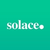

#  kdb+ interface for Solace PubSub+ broker

 

A KX [Fusion interface](https://code.kx.com/q/interfaces/#fusion-interfaces)

This interface lets you communicate with a Solace PubSub+ event broker from a kdb+ session. The interface follows closely the [Solace C API](https://docs.solace.com/Solace-PubSub-Messaging-APIs/C-API/c-api-home.htm). Exposed functionality includes

-   subscription to topics on Solace brokers
-   direct/persistent/guaranteed messaging functionality
-   endpoint management

## New to kdb+ ?

Kdb+ is the world's fastest timeseries database, optimized for ingesting, analyzing and storing massive amounts of structured data. To get started with kdb+, please visit https://code.kx.com/q/learn/ for downloads and developer information. For general information, visit https://kx.com/

## New to Solace PubSub+ ?

Solace PubSub+ Event Broker efficiently streams events and information across cloud, on-premises and within IoT environments. The “+” in PubSub+ means it supports a wide range of message exchange patterns beyond publish/subscribe. These include request/reply, streaming and replay, as well as different qualities of service, such as best effort and guaranteed delivery.

You can get started quickly by using free Standard Edition of the Solace [software broker](https://solace.com/products/event-broker/software/) or spin up a free instance on [Solace Cloud](https://console.solace.cloud/login/new-account).

If you have any Solace-related questions, you can raise them at [Solace Community](https://solace.community/).

### Use cases

The event broker is used across a number of sectors including

-   airline industry (air-traffic control)
-   financial services (payment processing)
-   retail (supply-chain/warehouse management)

:globe_with_meridians:
[Other sectors](https://solace.com/use-cases/)

## API Documentation

:point_right: [`API reference`](docs/reference.md)

## Using Solace RESTful Documentation

:point_right: [`RESTful API`](docs/solacerest.md)

## Installation Documentation

:point_right: [`Install guide`](docs/install.md)

## Building From Source

:point_right: [`Building guide`](docs/build.md)

## Example Setup

:point_right: [`Examples`](docs/example.md)

## Unsupported functionality

Currently transactional-based messaging is unsupported.

## Status

The interface is currently available under an Apache 2.0 licence and is supported on a best effort basis by the Fusion team. This interface is currently in active development, with additional functionality to be released on an ongoing basis.

If you find issues with the interface or have feature requests please  [raise an issue](../../issues).

To contribute to this project please follow the [contribution guide](CONTRIBUTING.md).
