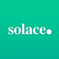

#  Solace interface to kdb+

The [Solace PubSub+ Event Broker](https://solace.com/products/event-broker/software/) can be used to efficiently stream events and information across cloud, on-premises and within IoT environments. The “+” in PubSub+ indicates its support of wide-ranging functionality beyond publish-subscribe. This includes request-reply, streaming and replay, as well as different qualities of service, such as best-effort and guaranteed delivery.

## Use cases

The event broker is used across a number of sectors including

-   airline industry (air-traffic control)
-   financial services (payment processing)
-   retail (supply-chain/warehouse management)

:globe_with_meridians:
[Other sectors](https://solace.com/use-cases/)

## Kdb+/Solace integration

This interface lets you communicate with a Solace PubSub+ event broker from a kdb+ session. The interface follows closely the [Solace C API](https://docs.solace.com/Solace-PubSub-Messaging-APIs/C-API/c-api-home.htm). Exposed functionality includes

-   subscription to topics on Solace brokers
-   direct/persistent/guaranteed messaging functionality
-   endpoint management

[Install guide](../README.md#installation)

## Status

The interface is currently available under an Apache 2.0 licence and is supported on a best effort basis by the Fusion team. This interface is currently in active development, with additional functionality to be released on an ongoing basis.

[Issues and feature requests](../../../issues) 

[Guide to contributing](../../../CONTRIBUTING.md)